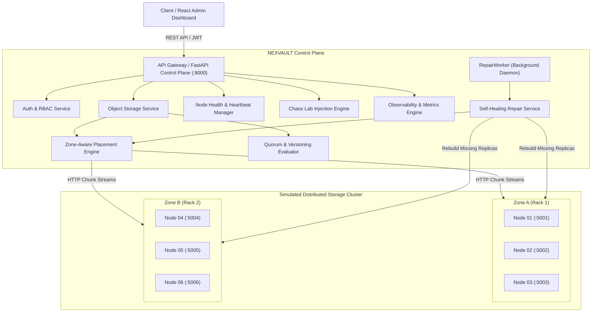

# NEXVAULT — Enterprise Distributed Object Storage & Control Plane

NEXVAULT is a fault-tolerant, self-healing distributed object storage system designed for high durability, cross-zone redundancy, cryptographic integrity verification, and dynamic chaos-driven resilience testing.

---

## 1. Vault Distributed Object Storage Architecture

NEXVAULT separates the **Metadata Control Plane** from the **Physical Data Plane**. The control plane orchestrates authentication, bucket policies, replica placement, health monitoring, integrity scanning, and autonomous self-healing, while dedicated storage node daemons handle high-throughput chunk streaming and local disk persistence.



---

## 2. Core Subsystems

### 2.1 Storage Nodes & Cluster Topology
* **6 Physical Storage Daemons**: Dedicated HTTP daemons running on `127.0.0.1:5001` through `127.0.0.1:5006`.
* **Failure Zone Isolation**:
  * **Zone A**: `node-01`, `node-02`, `node-03`
  * **Zone B**: `node-04`, `node-05`, `node-06`
* **Isolated Disk Storage**: Replicas and chunks are written directly to disk under `storage/nodes/node-XX/chunks/{chunk_id}` with dedicated metadata.
* **Storage Daemon Endpoints**:
  * `PUT /chunks/{chunk_id}` — Write chunk binary payload with verification
  * `GET /chunks/{chunk_id}` — Read chunk binary payload
  * `DELETE /chunks/{chunk_id}` — Remove chunk
  * `POST /chaos/offline` & `POST /chaos/online` — Physical reachability simulation
  * `POST /chaos/corrupt` — Direct byte corruption (bit rot injection)
  * `GET /health` — Storage node health check

### 2.2 Zone-Aware Placement Engine
* Distributes replicas across distinct physical storage nodes while enforcing **failure-zone diversity**.
* For Replication Factor 3 (`RF=3`), placement selects nodes across both Zone A and Zone B (e.g. 2 nodes in Zone A and 1 in Zone B, or vice-versa), ensuring the cluster survives the total loss of an entire failure zone.
* Balances disk capacity and current utilization across eligible nodes.

### 2.3 Quorum & Versioning Model
* **Tunable Quorum**:
  * Default Policy (`REPLICATION_3`): $N=3, W=2, R=2$.
  * High Availability Policy (`REPLICATION_2`): $N=2, W=2, R=1$.
  * Extensible EC Framework (`ERASURE_CODING_4_2`): $N=6, W=5, R=4$.
* **Monotonic Versioning**: Every write generates an atomically incremented version ID. Soft deletions create a tombstone version, preventing silent concurrent overwrites and allowing point-in-time recovery.
* **Deterministic Latest-Version Resolution**: Read operations query healthy replica nodes; if a stale replica is detected, the latest version is served while scheduling a background sync for the stale node.

### 2.4 Cryptographic Data Integrity
* **Write Verification**: As chunks stream to target nodes, a cryptographic SHA-256 hash is computed. The storage daemon verifies the SHA-256 before persisting, and the control plane verifies the stored checksum before updating metadata.
* **Read-Time Verification & Transparent Failover**: During object downloads, if the chosen primary replica fails SHA-256 verification (simulating physical bit rot), the system transparently fails over to another healthy replica, serves the uncorrupted file without client error, and flags the damaged replica for repair.

### 2.5 Failure Detection & Node Health
* Storage nodes maintain periodic heartbeats.
* States tracked:
  * `HEALTHY` — Responding to health checks with <100ms latency.
  * `SUSPECTED` — Missed heartbeats, currently under health probe.
  * `FAILED` — Node offline or unresponsive; excluded from read/write pools.
  * `RECOVERING` — Node returned online; replica inventory undergoing verification.

### 2.6 Automatic Replica Repair & Reconciliation
* **Background Repair Worker**: [`RepairWorker`](file:///c:/Users/ROBIN/OneDrive/NEXVAULT/app/workers/repair_worker.py) runs autonomously every 5.0 seconds.
* **Durability Scan**: Identifies object versions whose active healthy replica count is below the policy replication factor.
* **Idempotency**: Prevents duplicate repair jobs for the same object version; reuses active tasks and avoids repair storms.
* **Self-Healing Pipeline**:
  1. Detect durability violation (`DURABILITY_VIOLATION` or `REPLICA_CORRUPTED`).
  2. Mark object version as `DEGRADED`.
  3. Create idempotent repair job.
  4. Fetch chunk from a verified healthy source replica.
  5. Select a placement-compliant replacement node (preserving zone diversity).
  6. Stream chunk to target node.
  7. Compute and verify SHA-256 against original catalog metadata.
  8. Commit new replica metadata and restore object status to `HEALTHY`.
  9. Emit structured audit events and update recovery metrics.

### 2.7 Rebalancing Engine
* Monitors capacity skew across nodes.
* Calculates maximum skew percentage and cross-zone symmetry.
* Migrates eligible replicas to newly added or underutilized nodes with throttled concurrency, verifying destination checksums before purging source replicas.

---

## 3. Observability & Chaos Lab

### 3.1 Real-Time Events Engine
Every distributed state transition emits standardized structured events:
* Node Lifecycle: `NODE_REGISTERED`, `NODE_FAILED`, `NODE_RESTORED`, `NODE_RECOVERING`
* Network Simulation: `NETWORK_PARTITION`, `NETWORK_HEALED`
* Durability & Integrity: `REPLICA_CORRUPTED`, `CHECKSUM_VERIFIED`, `INTEGRITY_SCAN_STARTED`, `INTEGRITY_SCAN_COMPLETED`
* Autonomous Healing: `REPAIR_CREATED`, `REPAIR_STARTED`, `REPLICA_REBUILT`, `OBJECT_HEALTHY`
* Capacity: `REBALANCE_STARTED`, `REBALANCE_COMPLETED`

### 3.2 Real Cluster Metrics
* **Cluster Overview**: Nodes (healthy, degraded, failed), object health, active repairs, utilization percent, logical vs physical storage bytes, overhead multiplier.
* **Recovery Metrics**: Total repairs, successful repairs, failed repairs, average recovery time (seconds), fastest/slowest recovery, bytes recovered.

### 3.3 Chaos Lab Injection
* **Node Failure**: Physically brings the storage node daemon offline.
* **Node Recovery**: Brings the daemon back online and executes full replica reconciliation.
* **Bit Rot Injection**: Modifies physical bytes on disk to test checksum detection.
* **Network Partition**: Simulates control plane isolation from specific node ports.
* **Integrity Scrub**: Full-cluster cryptographic sweep identifying corrupted blocks.

---

## 4. Architectural Trade-offs

| Dimension | NEXVAULT Approach | Trade-off / Rationale |
|---|---|---|
| **Durability vs. Storage Overhead** | RF=3 default (3x physical overhead across 2 failure zones) | Prioritizes zero-data-loss and instant recovery over raw disk efficiency. |
| **Availability vs. Consistency** | Quorum writes ($W=2$ of 3) with monotonic versions | Tolerates individual node crashes during write while maintaining linearizable reads. |
| **Repair Speed vs. Bandwidth** | Asynchronous batched self-healing | Prevents repair storms from degrading active client read/write bandwidth. |
| **Rebalancing vs. System Load** | Configurable threshold-based rebalancing | Avoids unnecessary replica thrashing for small transient skews. |

---

## 5. Getting Started & Running Locally

### 5.1 Prerequisites
* Python 3.11+
* Node.js 18+ (for frontend dashboard)

### 5.2 Backend Installation & Node Cluster Startup
```bash
# 1. Install Python dependencies
pip install -r requirements.txt

# 2. Start all 6 physical storage daemons (ports 5001-5006)
python scripts/start_nodes.py

# 3. Start the NEXVAULT FastAPI Control Plane (port 8000)
uvicorn app.main:app --host 127.0.0.1 --port 8000
```

### 5.3 Frontend Dashboard Startup
```bash
cd frontend
npm install
npm run dev
# Dashboard accessible at http://localhost:5173
```

### 5.4 Running the Automated Test Suite
```bash
# Run all 29 integration and unit tests
python -m pytest tests/ -v
```

---

## 6. Live Demonstration Guide

To demonstrate NEXVAULT's autonomous durability and recovery capabilities:

1. **Verify Baseline State**:
   ```bash
   python scripts/reset_demo_state.py
   ```
   *Confirms all 6 nodes HEALTHY, 0 degraded objects, 0 active repairs.*

2. **Run the 16-Step Live End-to-End Self-Healing Test**:
   ```bash
   python scripts/verify_automatic_repair_live.py
   ```
   *Demonstrates:*
   * Uploading an RF=3 object.
   * Physically killing a replica node through Chaos Lab.
   * Autonomous discovery and self-healing by `RepairWorker` without manual intervention.
   * SHA-256 cryptographic verification on replacement node.
   * Object restoration to `HEALTHY`.
   * Real disk bit rot injection and recovery via integrity scrub.
   * Node restoration and replica inventory reconciliation.

3. **Reset to Clean Presentation State**:
   ```bash
   python scripts/reset_demo_state.py
   ```
